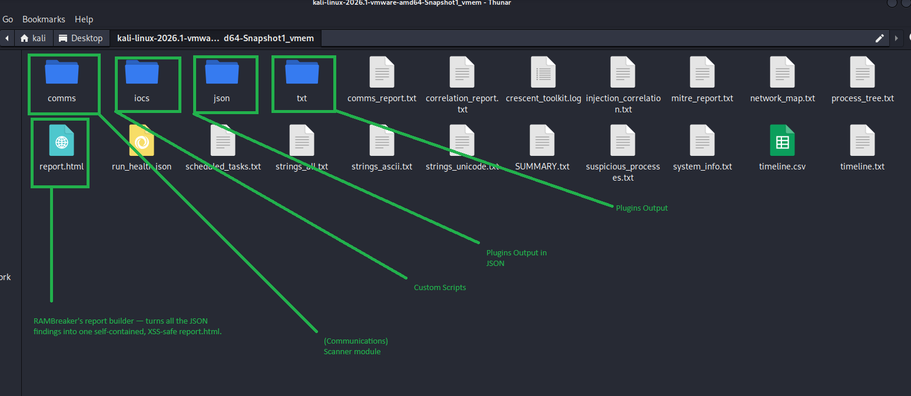
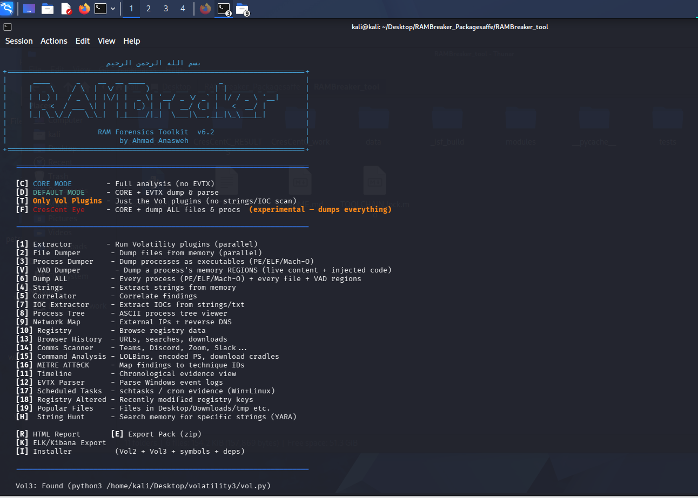
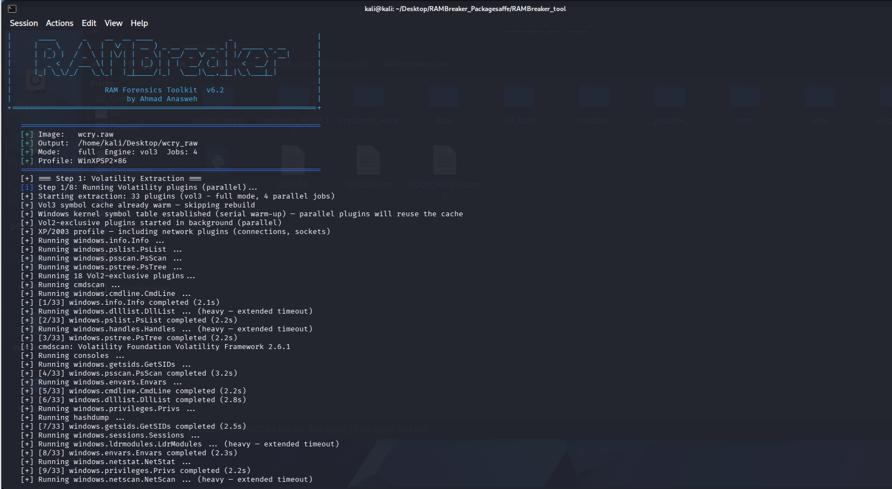
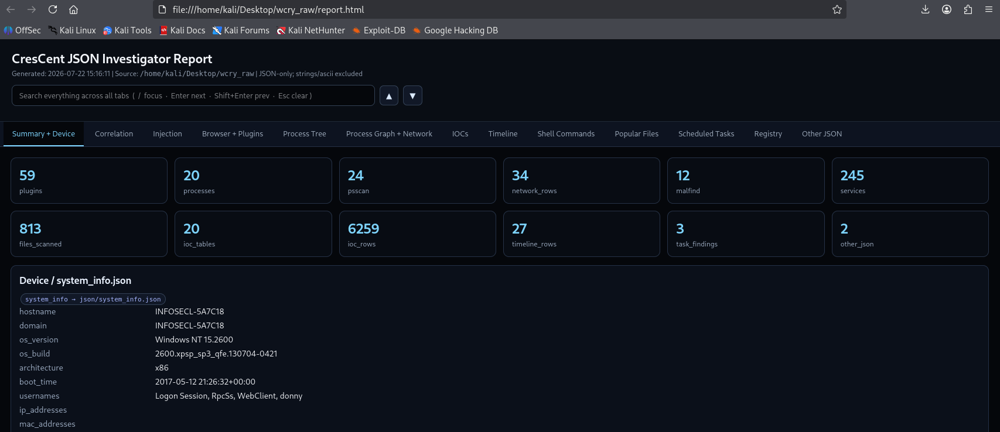
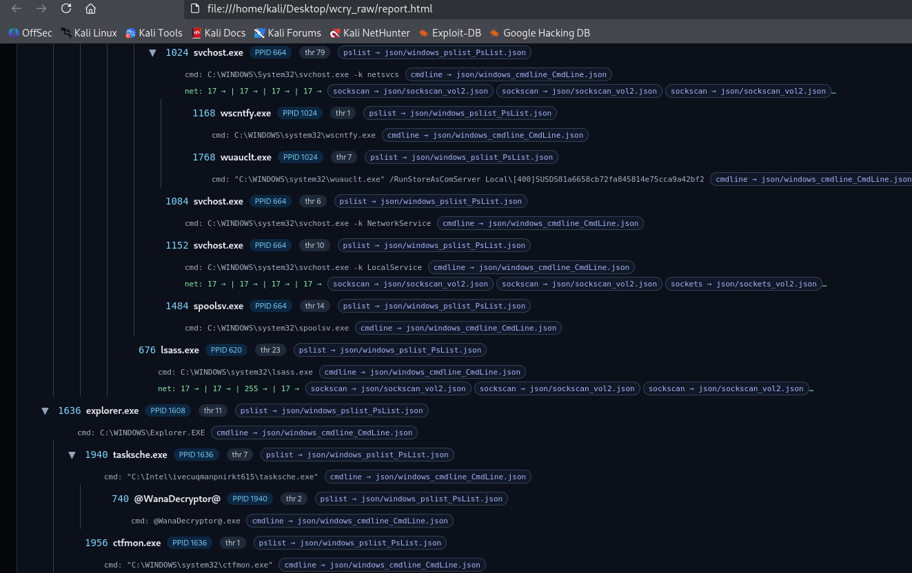
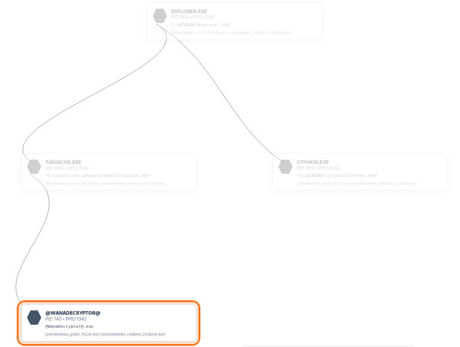
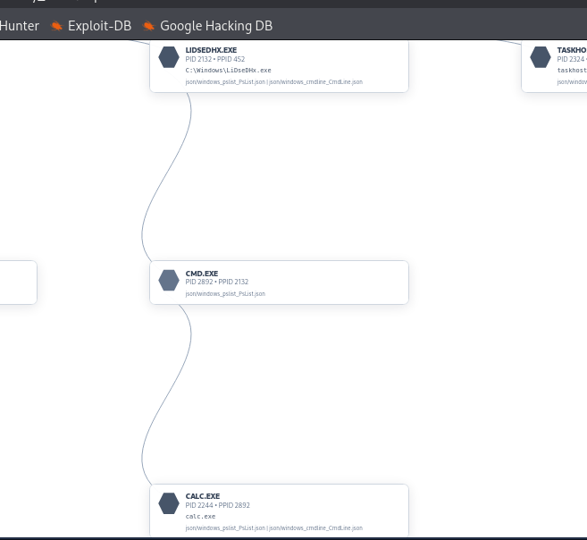

# RAMBreaker (v6.2)

[](LICENSE)

A modular memory-forensics framework over **Volatility 2 / 3**: feed it a RAM
image (`.raw`, `.mem`, `.lime`, `.dmp`, VMware `.vmem`) and it auto-detects the
OS, drives the right Volatility engine, and produces one self-contained,
interactive `report.html` — **Windows, Linux, and macOS**.

Full documentation lives in [`docs/`](docs/) — start with
[`RAMBreaker_Guide.html`](docs/RAMBreaker_Guide.html). Release notes are in
[`CHANGELOG.md`](CHANGELOG.md).

## Why RAMBreaker

Have you ever...

Have you ever  …spent the first 30 minutes just guessing Vol2 or Vol3, Windows or Linux? 
------------------------------------------------------------------------------------------------------------------------------------------------------------------------------------------------------------------------------
Have you ever  …hit a Linux image whose kernel has no ISF built anywhere?
------------------------------------------------------------------------------------------------------------------------------------------------------------------------------------------------------------------------------
Have you ever  …been told the DFIR report is due in two hours?
------------------------------------------------------------------------------------------------------------------------------------------------------------------------------------------------------------------------------
Have you ever  …been stuck in a CTF at 3am, running plugin after plugin for one flag?
------------------------------------------------------------------------------------------------------------------------------------------------------------------------------------------------------------------------------
Have you ever  …juggled a dozen tools and stitched the output together by hand?
------------------------------------------------------------------------------------------------------------------------------------------------------------------------------------------------------------------------------
Have you ever  …had a tool scream 'MALWARE!' at a perfectly legit process?
------------------------------------------------------------------------------------------------------------------------------------------------------------------------------------------------------------------------------

RAMBreaker exists to kill exactly those moments: point it at an image and it
figures out the OS and engine itself, does everything it can to get the Linux
kernel symbols it needs (including rebuilding them from data baked into the
image, with no internet required), and — when something truly can't be
resolved — tells you precisely what and why instead of handing back a
quietly-empty report.

## Scope & honest limitations

Volatility is the engine that actually reads memory; RAMBreaker is the layer
that drives it, so you don't have to babysit it. In plain terms:

- **Figuring out what you're looking at.** Before it can run anything,
  RAMBreaker has to work out which OS the image is from and whether it needs
  Volatility 2 or 3. It does this automatically, so you just point it at the
  file.
- **The hard part: Linux kernel symbols.** To make sense of a Linux memory
  image, Volatility needs a "map" of that exact kernel version's internal
  data structures (called an ISF). If that map isn't already published
  somewhere, analysis normally can't proceed at all. RAMBreaker tries several
  ways to get or build one automatically — including, for kernels from about
  2020 onward, extracting that map directly from information the kernel
  already carries inside its own memory. That means no internet connection
  and no external package is needed for many modern Linux images.
- **When it truly can't be done.** For a kernel old enough to lack that
  built-in information, with no published map and no debug package
  available anywhere — or one Volatility's own plugins simply don't
  understand yet — the run will fail. But it fails loudly, telling you
  exactly what went wrong (missing symbols vs. a data-structure mismatch vs.
  a timeout), instead of quietly producing a report that looks fine but is
  actually empty.
- **macOS is the weakest link.** Apple systems have far fewer public symbol
  resources to begin with, and lack the "extract the map from the image
  itself" trick that saves the day on Linux — so macOS support depends more
  on best-effort community data.

RAMBreaker works best on the common cases: Windows 10/11, and Linux distros
with either published or self-buildable kernel symbols.

## Run

```bash
python3 crescent_toolkit.py                          # interactive menu
python3 crescent_toolkit.py full -i image.raw -o ./results/
```

`-i` is the image (not `-f`). See the docs for modes, flags, and the CLI surface.

## Output



Every run drops one results directory containing the raw plugin output (`json/`,
`txt/`), per-category artifacts (`comms/`, `iocs/`), custom-script reports
(`comms_report.txt`, `network_map.txt`, `timeline.csv`, etc.), and the final
`report.html` — the single self-contained file you actually hand someone.

## Screenshots

The walkthrough below is a real run against a WannaCry-infected Windows XP
image (`wcry.raw`), from the menu through to the interactive report.

**Interactive main menu (v6.2)** — the command surface: analysis modes (`[C]`
Core, `[D]` Default, `[T]` Vol-plugins only, `[F]` CresCent Eye "dump
everything") and the full feature list (extractors, dumpers, IOC/MITRE mapping,
timeline, and more). Volatility 3 is auto-detected at the bottom.



**Live extraction** — driving Volatility 3 against `wcry.raw` (auto-profiled
`WinXPSP2×86`, 4 parallel jobs). Step 1/8 fans out 33 plugins in parallel,
reusing the warmed kernel-symbol cache while Vol2-exclusive network plugins run
in the background; per-plugin completion times stream as they finish.



**Report — Summary + Device** — the self-contained `report.html` opening view:
at-a-glance stat tiles (plugins, processes, psscan, network rows, malfind hits,
services, files scanned, IOC rows) with a global search bar and tabbed
navigation, over the parsed device fingerprint (host `INFOSECL-5A7C18`,
Windows NT 5.2600 x86).



**Report — Process Tree** — interactive parent→child tree with each process
linked back to its source plugin JSON. The WannaCry chain is visible:
`explorer.exe → tasksche.exe → @WanaDecryptor@.exe`.



**Report — Process Graph (lineage)** — node-and-edge view tracing
`EXPLORER.EXE → TASKSCHE.EXE` with the malicious `@WANADECRYPTOR@` node
highlighted, each card showing PID/PPID, image path, and backing plugin sources.



**Report — Process Graph (injected/staged processes)** — a second region of the
graph showing `LIDSEDHX.EXE`, `TASKHOST`, and `CMD.EXE (PID 2892)` spawning
`CALC.EXE` — a classic hollowing/injection decoy pattern surfaced with full
parent-child links.



## Development

After cloning, **enable the git pre-commit hook** — git does not clone hooks, so
this is a one-time per-clone step. It runs the two zero-dependency test suites
before every commit and blocks the commit if either fails:

```bash
git config core.hooksPath .githooks
```

Run the suites manually any time (both are ~2 s and need no memory image):

```bash
python3 tests/run_tests.py     # Tier-A: pure logic — run_health, crash_report, IOC, XSS, download integrity
python3 tests/run_canary.py    # Tier-B: drives the real extraction pipeline against a fake Vol3 stub
```

Bypass the hook in a genuine emergency with `git commit --no-verify`.

Toolchain version pins (Volatility, dwarf2json, Python) are recorded in
[`TOOLCHAIN.lock.md`](TOOLCHAIN.lock.md).

## License

[MIT](LICENSE) — use it, fork it, build on it. It drives Volatility 2/3 and
bundles dwarf2json as external tools, which keep their own licenses.
